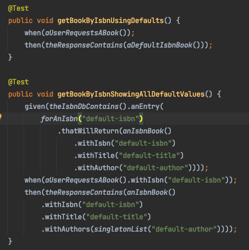
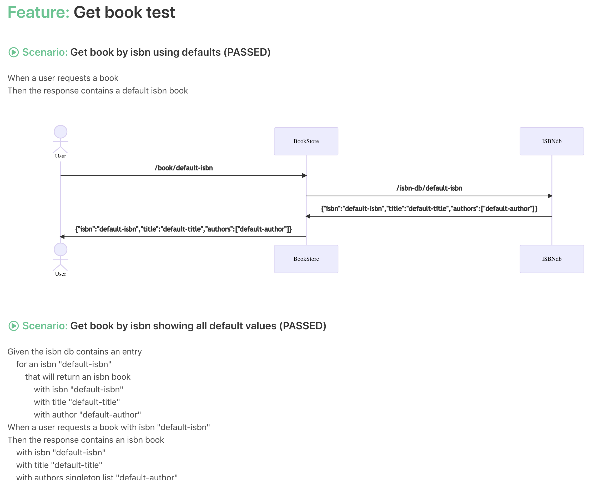

# Smart BDD

## Overview

Create interactive html documentation / feature files from Java code:

## Source Code



## Below is an interactive html snippet that is generated from the above source code



## Implemented Features

- Create html documentation / feature files from Java code (as above)
- Capture downstream interactions and show with diagrams
- Capture downstream data such as HTTP request/response headers and body
- More consistent as builders are used to set state and exercise the system under test
- More productive as you are encouraged to use best practices and don't have the complexities of traditional glue layers
- Results can be persisted so that previous test results can be queried

The projects aim is to:

- Improve the quality and usefulness of the documentation
- Improve the confidence and coverage of the tests
- Improve the performance of the tests
- Improve the productivity of writing and maintaining the tests

## Road Map:

- Ability to re-run tests
- Ability to modify the state under test, for example a textbox or a dropdown to modify values
- Steps wrapped in actions:
    - So that they can be executed asynchronously to improve performance
- Validate correctness of the scenario by adding/removing and or mutating steps and asserting the expected state and or
  behavior.
- Define the data and behaviour JSON documents and generate the builders
- The above declarative JSON could also be used to generate a demo application
- Store reports

## smart-bdd usage:

Please see `example:cucumbers`.

1. Import the `report` project `testImplementation("io.bitsmart.bdd:report:1.0-SNAPSHOT")`
   or `testImplementation(project(":report"))`
2. Copy the file `org.junit.platform.launcher.TestExecutionListener` to `src/test/resources/META-INF/services`
3. Add `@ExtendWith(ReportExtension.class)` to any class that you want to generate a report from.

### Example to from `example:bookstore`

```
@ExtendWith(ReportExtension.class)
public class GetBookTest {
    @Test
    public void getBook() {
        whenGetBookIsCalled();
        thenTheBookIsReturned();
    }
    ...
}
```

Will produce the following step defs:

```
When get book is called 
Then the book is returned
```

### Example to from `example:cucumbers`

```
void givenOneRedAndOneBlueCucumber_whenIEatOneRed_IhaveOneBlueCucumberLeft() {
    given(iHave(aCucumber().withColour("red"), andACucumber().withColour("blue")));
    when(iRequestToEatCucumbers().withColour("red"));
    then(iShouldHaveCucumbers().withquantity(1));
}
```

Will produce the following step defs:

```
Given I have a cucumber with colour "red" and a cucumber with colour "blue" 
When I request to eat cucumbers with colour "red" 
Then I should have cucumbers with quantity 1 with colour "blue"
```

## smart-bdd projects:

| project name  | package  | description  | notes  |
|------------|-------------|--------------|--------|
| root       | io.bitsmart.bdd | root for repo  |
| report     | io.bitsmart.bdd.report | reporting extension `@ReportExtension` and report creation (.html and .json)  | Should be `@smart-bdd`? |
| wordify    | io.bitsmart.bdd.wordify | wordify java code | |
| ft         | io.bitsmart.bdd.ft | FT for the report generation | | 
| test-utils | io.bitsmart.bdd.report.utils | testing utils such as builder | only the builders at the moment | 
| examples   | n/a| examples of using smart-bdd |  | 
| webpage    | n/a| legacy vue js | to be replaced with react |

Notes:

* Should everything be prefixed with `smart-`? `smart-report`, `smart-wordify`, `smart-test-utils` etc...
* Need to understand what projects relate to bdd, tdd and or testing.
* Maybe all `io.bitsmart.bdd`, `io.bitsmart.tdd`, and `io.bitsmart.test`?

## Testing Locally

`./gradlew test`

## Deploying Locally

Create report, test-utils, test-utils  
`./gradlew publishToMavenLocal`

To check the jar was created in maven local  
`ls -la ~/.m2/repository/io/bitsmart/bdd/report/1.0-SNAPSHOT`

Then use the following in your app  
`testImplementation("io.bitsmart.bdd:report:1.0-SNAPSHOT")`

## Comparison to existing approaches:

The fundamental approach is in stark contrast to existing frameworks: Cucumber, JBehave, Concordion etc...

Traditionally BDD frameworks have approximately four layers:

1. Feature file / specification / UI:
    - A feature is a text description of a feature that consists of scenarios and are made up of steps
    - This is the first thing that is writen and leads the design for the following.
1. The glue layer:
    - Matches Java method for that step and the corresponding arguments. Usually a regular expression.
1. Orchestration of the actual FT framework:
    - A Java method has been supplied data from the glue layer. You'll need to orchestrate your actual FT framework to
      actually do any testing.
    - You may have more data than you require - in non-trivial steps you have to chose code re-use or code duplication.
      Opting for code reuse makes glue layer and down more complex.
    - You may have a different domain and or bounded context for the feature file and the actual FT framework domain.
      This means adapting/transforming the data for the FT framework.
1. The actual FT framework:
    - This usually would have the following functionality:
        - Set state before and after tests.
        - Exercise the thing under test.
        - Store state so that you assert on expected behaviour.
        - State and behaviour verification.
    - This has been designed to accommodate additional complexities from above.

Adding new data, steps and or features is not linear because of the following:

* Complexity
* Coupling to between layers
* Limitations in the glue layer
    * Forcing step definitions to be constructed in a certain way. Possibly not the way you planned and or wanted.
    * Forcing refactoring when you alter steps definitions

These 3 forces can unfortunately can compound each other. Complexity and coupling should be kept to a minimum not part
of the solution. Layers 1-3 exist so that we can have feature files, these serve as static documentation for the system.
There are no guaranties that the documentation is consistent, in fact there isn't anything enforcing it.

The alternative to this is generating dynamic, consistent documentation. With smart-bdd you leg up on developing the
actual FT framework, so you can focus on testing your application. You add `@ReportExtension` annotation to your class,
this will generate a report. There is a `wordify` process that takes the Java code and converts it in English sentences.
For example `givenSomething()` would produce `given something`. There is a strong emphasis on using builders therefore
forcing you to create a fluent API.

The `wordify` process isn't finished, you can't simply get rid of complexity and coupling, but it's the gaol of this
project to reduce both of them.

With thanks to https://github.com/bodar/yatspec who did a similar project that worked with JUnit 4.