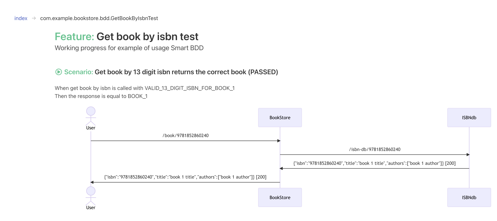

# Smart BDD

### Overview

I'd like to introduce a small guide to creating awesome functional tests and documentation for a Spring project.

Smart BDD is a productive way to test, document and implement behaviour driven development.

With Smart BDD you write the code first using best practices and this generates:

* Feature files that serve as documentation
* UML diagrams to better document the product
* Many more features are being developed

#### Example of documentation generated by code. This is a simple REST service that fetches a book.



Let's say your existing spring integration test looks like this

```java
@SpringBootTest(webEnvironment = SpringBootTest.WebEnvironment.RANDOM_PORT)
public class BookControllerIT {
    // skipped setup...
    
    @Order(0)
    @Test
    public void getBookBy13DigitIsbn_returnsTheCorrectBook() {
        whenGetBookByIsbnIsCalledWith(VALID_13_DIGIT_ISBN_FOR_BOOK_1);
        thenTheResponseIsEqualTo(BOOK_1);
    }

    public void whenGetBookByIsbnIsCalledWith(String isbn) {
        HttpHeaders headers = new HttpHeaders();
        headers.setAccept(singletonList(MediaType.APPLICATION_JSON));
        response = template.getForEntity("/book/" + isbn, String.class, headers);
    }
    
    // skipped helper classes...
}
```

This is good enough to test your book store application.

Generating documentation and from code and enriching your tests is very easy. 
1. Taking the code above you just add `@ExtendWith(SmartReport.class)` to use Smart BDD.
2. To future benefit from UML:

```java
@ExtendWith(SmartReport.class)
@SpringBootTest(webEnvironment = SpringBootTest.WebEnvironment.RANDOM_PORT)
public class BookControllerIT {
    // skipped setup...
    
    @Override
    public void doc() {
        featureNotes("Working progress for example of usage Smart BDD");
    }

    @BeforeEach
    void setupUml() {
        sequenceDiagram()
            .addActor("User")
            .addParticipant("BookStore")
            .addParticipant("ISBNdb");
    }

    @Order(0)
    @Test
    public void getBookBy13DigitIsbn_returnsTheCorrectBook() {
        whenGetBookByIsbnIsCalledWith(VALID_13_DIGIT_ISBN_FOR_BOOK_1);
        thenTheResponseIsEqualTo(BOOK_1);
    }

    public void whenGetBookByIsbnIsCalledWith(String isbn) {
        HttpHeaders headers = new HttpHeaders();
        headers.setAccept(singletonList(MediaType.APPLICATION_JSON));

        sequenceDiagram().add(aMessage().from("User").to("BookStore").text("/book/" + isbn));
        response = template.getForEntity("/book/" + isbn, String.class, headers);

        List<ServeEvent> allServeEvents = getAllServeEvents();
        allServeEvents.forEach(event -> {
            sequenceDiagram().add(aMessage().from("BookStore").to("ISBNdb").text(event.getRequest().getUrl()));
            sequenceDiagram().add(aMessage().from("ISBNdb").to("BookStore").text(
                event.getResponse().getBodyAsString() + " [" + event.getResponse().getStatus() + "]"));
        });

        sequenceDiagram().add(aMessage().from("BookStore").to("User").text(response.getBody() + " [" + response.getStatusCode().value() + "]"));
    }

    private void thenTheResponseIsEqualTo(IsbnBook book) {
        assertThat(bookFromJson(response.getBody())).isEqualTo(book);
    }
    
    // skipped helper classes...
}
```

**Firstly**
Smart BDD uses JUnit5 and this is the only dependency for Smart BDD.

1. Import the `report` project
    1. Gradle `testImplementation("io.bit-smart.bdd:report:0.1-SNAPSHOT")`
    2. Or Maven
   ```xml
   <dependency>
      <groupId>io.bit-smart.bdd</groupId>
      <artifactId>report</artifactId>
      <version>0.1-SNAPSHOT</version>
      <scope>test</scope>
   </dependency>
   ```
2. Add `@ExtendWith(SmartReport.class)` to any class that you want to generate a report from.

3. A link to the generated results and documentation is outputted in the console i.e.

```text
Results Index: file:///var/folders/x6/w8rxpq011g328g44nx7fkz7w0000gn/T/io.bitsmart.bdd.report/data/index.json
HTML    Index: file:///var/folders/x6/w8rxpq011g328g44nx7fkz7w0000gn/T/io.bitsmart.bdd.report/report/index.html
Results Suite: file:///var/folders/x6/w8rxpq011g328g44nx7fkz7w0000gn/T/io.bitsmart.bdd.report/data/TEST-com.example.bookstore.bdd.GetBookByIsbnTest.json
HTML    Suite: file:///var/folders/x6/w8rxpq011g328g44nx7fkz7w0000gn/T/io.bitsmart.bdd.report/report/TEST-com.example.bookstore.bdd.GetBookByIsbnTest.html
```

Example results:

```json
{
  "title": "Get book by isbn test",
  "name": "com.example.bookstore.bdd.GetBookByIsbnTest",
  "className": "GetBookByIsbnTest",
  "packageName": "com.example.bookstore.bdd",
  "summary": {
    "passed": 11,
    "skipped": 0,
    "failed": 0,
    "aborted": 0,
    "tests": 11
  },
  "notes": {
    "textNotes": [
      "Working progress for example of usage Smart BDD"
    ],
    "diagrams": []
  },
  "testCases": [
    {
      "wordify": "When get book by isbn is called with VALID_13_DIGIT_ISBN_FOR_BOOK_1\nThen the response is equal to BOOK_1",
      "status": "PASSED",
      "method": {
        "name": "getBookBy13DigitIsbn_returnsTheCorrectBook",
        "wordify": "Get book by 13 digit isbn returns the correct book",
        "arguments": []
      },
      "notes": {
        "textNotes": [],
        "diagrams": [
          "sequenceDiagram\n\tactor User\n\tparticipant BookStore\n\tparticipant ISBNdb\n\tUser->>BookStore: /book/9781852860240\n\tBookStore->>ISBNdb: /isbn-db/9781852860240\n\tISBNdb->>BookStore: {\"isbn\":\"9781852860240\",\"title\":\"book 1 title\",\"authors\":[\"book 1 author\"]} [200]\n\tBookStore->>User: {\"isbn\":\"9781852860240\",\"title\":\"book 1 title\",\"authors\":[\"book 1 author\"]} [200]"
        ]
      },
      "timings": {
        "beforeEach": 0,
        "afterEach": 0,
        "underTest": 0,
        "total": 0
      },
      "clazz": {
        "fullyQualifiedName": "com.example.bookstore.bdd.GetBookByIsbnTest",
        "className": "GetBookByIsbnTest",
        "packageName": "com.example.bookstore.bdd"
      }
    }
```

Note: The HTML document is just a visualisation of the results.

This is all we need to do to create generate documentation! It works by tokenising the source
code. `whenGetBookByIsbnIsCalledWith(VALID_13_DIGIT_ISBN_FOR_BOOK_1);` gets converted
to `When get book by isbn is called with VALID_13_DIGIT_ISBN_FOR_BOOK_1`. It uses JUnit5 to be powerful and extensible,
it even facilities re-running tests.

**Secondly**
We can add notes and diagrams. In the above example we used a UML DSL to generate the UML diagrams.

Because we are using wiremock, we have all we need to capture requests and responses. Capturing the downstream calls
serves as great documentation and insight in to how the service works.

Notes:

```java 
List<ServeEvent> allServeEvents = getAllServeEvents();
```

Above is a way to capture WireMock events, you're free to use any mocking framework, the only requirement for Smart BDD
is JUnit 5.

```java
allServeEvents.forEach(event -> {
    sequenceDiagram().add(aMessage().from("BookStore").to("ISBNdb").text(event.getRequest().getUrl()));
    sequenceDiagram().add(aMessage().from("ISBNdb").to("BookStore").text(
    event.getResponse().getBodyAsString()+" ["+event.getResponse().getStatus()+"]"));
});

sequenceDiagram().add(aMessage().from("BookStore").to("User").text(response.getBody()+" ["+response.getStatusCode().value()+"]"));
```

The above is a DSL for UML, it uses mermaid https://mermaid.js.org/intro/. As you can see this is a wrapper to create
sequence diagrams. This is under development and will in future iterations expose the ability to render all diagrams
that mermaid supports.

```java
@Override public void doc() {
    featureNotes("Working progress for example of usage Smart BDD");
}
```

Above generates feature notes. As Smart BDD is in development overriding a method has been chosen, it could be an
annotation such as `@doc`. You can also add diagrams here.

Because adding Smart BDD is so easy, I like to expose you to the less obvious benefits of upgrading your Spring 
integration tests.

Let's look at the business logic. Obviously you can use builders or any code style you want, I've chosen the style below 
as it was very quick to implement.

```java
@Test public void getBookBy10DigitIsbnThatIsConvertedTo13DigitIsbn_returnsTheCorrectBookBasedOn13DigitIsbn() {
    whenGetBookByIsbnIsCalledWith(VALID_10_DIGIT_ISBN_FOR_BOOK_1);
    thenTheResponseIsEqualTo(BOOK_1);
}
```

This generates (duplicate of picture above, so we can see side by side)


Notice how it is far easier to read the documentation than the code. Imagine if we had a downstream rest call to an ISBN
validating service rather than in this example validation is happening with an API call, then this would become obvious 
in the sequence diagram.

Also note that writing high level tests like this is good practice. An alternative would be:

```java
@Test
public void getBookBy13DigitIsbn_returnsTheCorrectBook() {
    final IsbnBook book = new IsbnBook(VALID_13_DIGIT_ISBN_FOR_BOOK_1, "book 1 title", singletonList("book 1 author"));
    
    stubFor(get(urlEqualTo("/isbn-db/"+VALID_13_DIGIT_ISBN_FOR_BOOK_1))
        .withPort(PORT)
        .willReturn(aResponse()
        .withHeader("Content-Type","application/json")
        .withBody(bookAsString(book))));

    HttpHeaders headers = new HttpHeaders();
    headers.setAccept(singletonList(MediaType.APPLICATION_JSON));
    ResponseEntity<String> response=template.getForEntity("/book/"+VALID_13_DIGIT_ISBN_FOR_BOOK_1, String.class, headers);

    assertThat(bookFromJson(response.getBody())).isEqualTo(book);
}
```

I've seen the above code far too often, a goal of this framework was actually to use best practices:

1. Express the intent of what is under test
2. Reuse code so that the documentation is consistent. Once you find the limits of using simple methods the natural
   progression is use builders. This really promotes consistent tests and documentation.

Notice the big method above that does it all:

* It is much harder to see the indent of the test.
* We have unnecessarily exposed implementation detail.
* This is not easy to maintain, duplicate tests would end up with duplicate code.
* This would lead to less coverage due to the effort of adding new tests and maintaining existing tests.

Note: things get interesting when you use builders:

```java
@Test
public void getBookUsingIsbn10() {
    given(theIsbnDbContains().anEntry(forAnIsbn(ISBN_13_DIGITS).thatWillReturn(aDefaultIsbnBook().withIsbn(ISBN_13_DIGITS))));
    when(aUserRequestsABook().withIsbn(ISBN_10_DIGITS));
    then(theResponseContains(aDefaultIsbnBook().withIsbn(ISBN_13_DIGITS)));
}
```

Above is a prototype of passing builders in to given/when/then methods. A future feature of Smart BDD could be to
consider the builders as actions, then:

* Make these actions parallel/async for performance
* Perform mutation testing:
    * For example run 0 to n of the given actions, to make sure your test actually works as expected
    * Change the values for the builders, again to make sure your test actually works as expected
    * You could specify how to handle blank strings or edge cases, the framework would inject all combinations for you
* Time these actions to identify bottlenecks
* Etc...

Above is an example of being smart with testing if you so chose.

The downside to this is the code is more complex, therefore it would take longer to write in the first place, and 
potentially harder to maintain. Builders work best when you have a small number of endpoints and large number of 
requirements.

For a Spring app, testing via SpringBootTest (or equivalent) is very productive it, but it lacks visibility. Visibility
and transparency are for collaboration and feedback.

To start working on a feature you must be clear on the requirements, a good way to achieve this is to write functional
tests and or have good documentation. Luckily we'll get both, it's the perfect starting point for a three amigos session
for visibility, transparency and clarity. A three amigos session is a common practice where the developer, a business
person such as a product owner and a QA engineer discuss the requirements. A session like this could be added to your
definition of when a work item can be started. Depending on your process and needs this can be great for your project.

Once you have completed the work and worked through nuances (covered by tests/documentation) you have the option demo
the completed work by showing your team the tests/documentation. Note this can also be part of your definition of done.
Showing the team should ensure high quality features, tests and documentation. The tests/documentation can be referred 
to by:

1. New developers
2. People in the business
3. People on support - When it's 2am in the morning, having good documentation will be appreciated
4. Anybody that needs a refresher on how something works

Every company, team, project is different - you might not need the above, but it's good to know it's an option.

For this and other reasons people use BDD frameworks. It's actually a very good idea to write functional requirements
first to make sure that you are implementing the correct behavior. This is also known as working outside in:

1. Write functional requirements first
2. Followed by the application interface (in this case rest), then the service,
3. Lastly the db access and or downstream calls.

Conventional BDD frameworks would typically be more complex and offer less functionally: 
* You would write the feature file first, then a glue layer and then the test code
* Testing more features becomes harder to maintain and the feature become more inconsistent
* Might be implemented in a different language, normally leading to poor quality

The point I was wanting to express is that, Smart BDD promotes doing the right thing, right with minimal effort.

With thanks to https://github.com/bodar/yatspec who did a similar project that worked with JUnit 4.

I'm looking for more real world usages, I've love help anyone to write new tests and or migrate legacy tests to this
framework. If you're interested please contact me - see https://github.com/jrbayliss for my contact details.